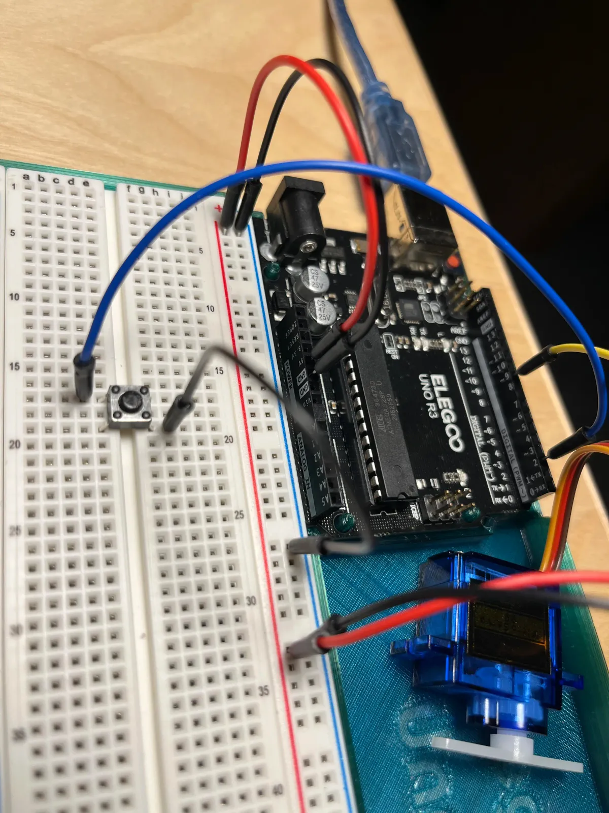

[Index](index.html)

# Servo class assignment

## Notes
* Uses a pullup on the button
* Code uses two counters, one to track the degree, the other to track the degree stop
  * There's probably a more elegant solution. This one uses the idea of negative and positive integers to differentiate going up in degrees vs going down

## Documentation


## Code

``` JS
#include <Servo.h>
#include <Button.h>

Servo myservo;

const int BUTTON_PIN = 2;
Button butt (BUTTON_PIN, INPUT_PULLUP);
int servoDegree;
int count = -18;

// Button controls the servo, with each click, moves the servo 10 degrees

void setup() {
  // put your setup code here, to run once:
  Serial.begin(9600);
  Serial.println("Button and servo demo");
  myservo.attach(9);
}

void loop() {
  // put your main code here, to run repeatedly:
  int action = butt.checkButtonAction();

  // when it's at the beginning, 0 degrees, count up
  if (count < 0 && action == Button::CLICKED) {
    servoDegree += 10;
    myservo.write(servoDegree);
    Serial.print("Degree: ");
    Serial.println(servoDegree);
    count += 1;
    Serial.print("Count: ");
    Serial.println(count);
  }

  // when it's at then end, 180 degrees, count down
  if (count >= 0 && action == Button::CLICKED) {
    servoDegree -= 10;
    myservo.write(servoDegree);
    Serial.print("Degree: ");
    Serial.println(servoDegree);
    count += 1;
    Serial.print("Count: ");
    Serial.println(count);
  }

  // when it's reached the end of 0, reset count
  if (count == 18) {
    count = -18;
  }
  // if (action == Button::CLICKED && servoDegree <= 180) {
  //   servoDegree += 10;
  //   myservo.write(servoDegree);
  //   Serial.println(servoDegree);
  // }
  else {
  }
};
```