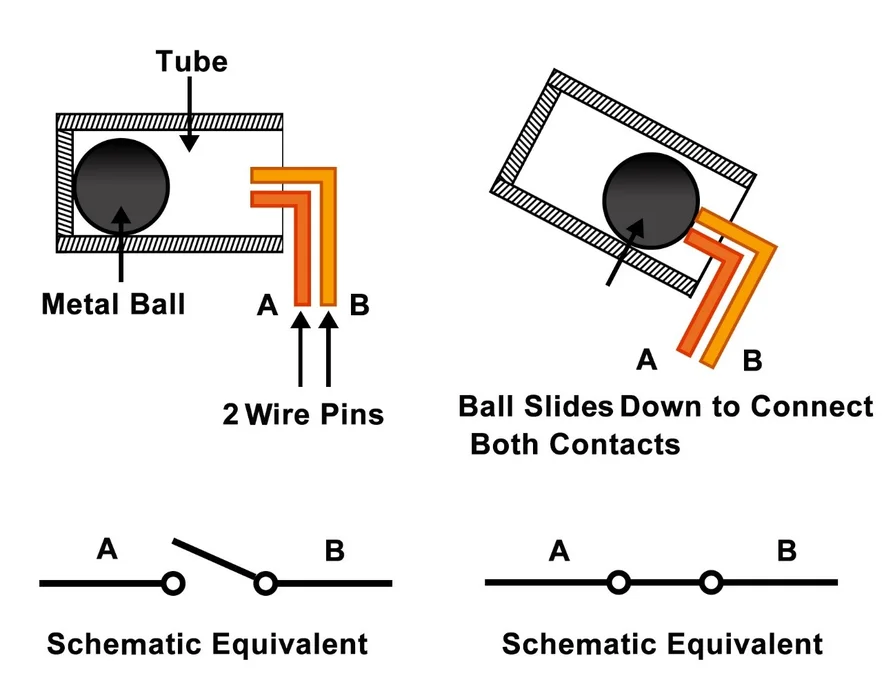
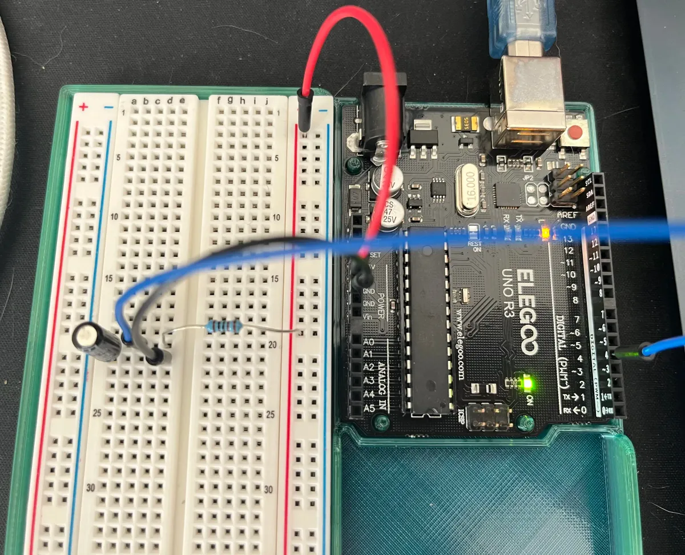
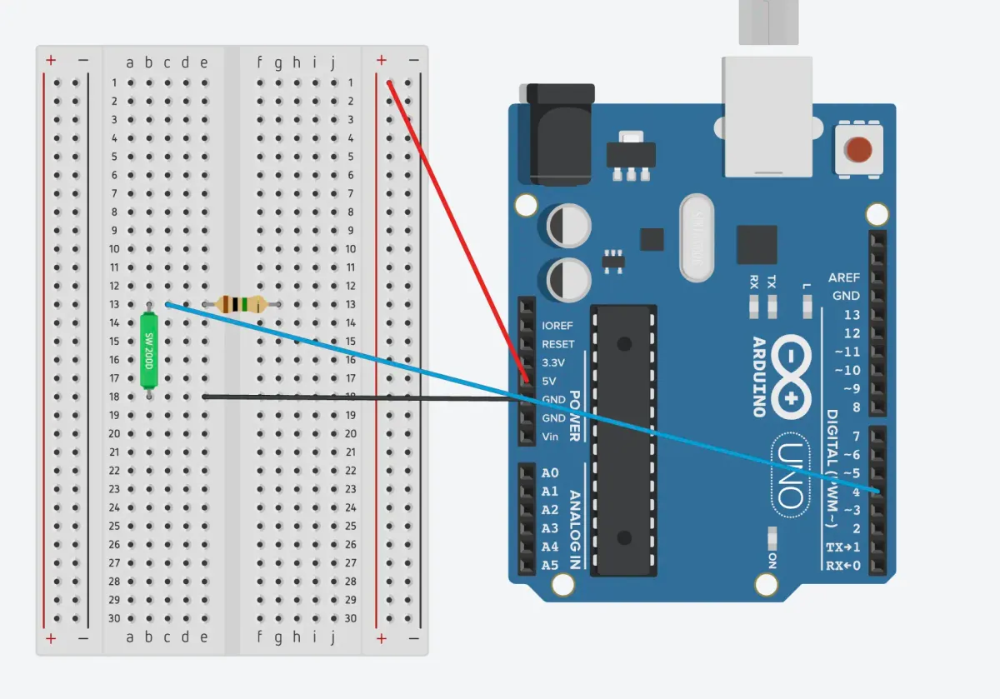
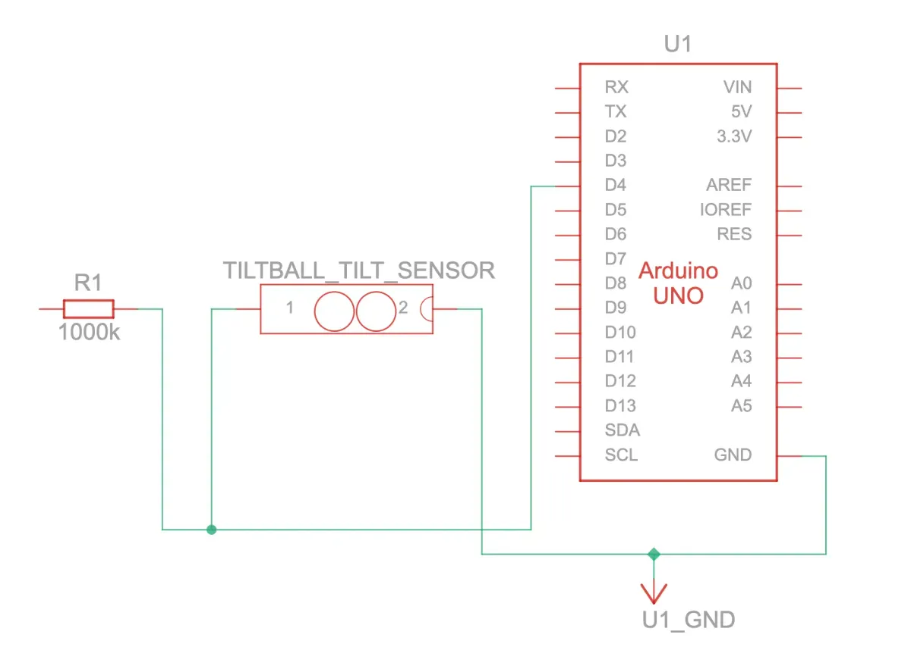

[Index](index.html)

# 2: Individual builds 

* <a href="#light-sensor">Light sensor</a>
* <a href="#tilt-ball-sensor">Tilt ball sensor</a>
* <a href="#wildcard">Wildcard: </a>

## Light sensor
Light sensor (analog input): Connect the photo cell light sensor (CdS photoresistor) to your Arduino. Have your sketch continuously print out the light level it detects on the serial monitor at 5 second intervals.

> CdS cells are little light sensors. As the squiggly face is exposed to more light, the resistance goes down. When it's light, the resistance is about ~1KΩ, when dark it goes up to ~10KΩ. 

* [Adafruit](https://www.adafruit.com/product/161)

### Source files
* [TinkerCAD source](https://www.tinkercad.com/things/dLJOOrkPkBk/editel?sharecode=9xs5nUTewtWsfD4-hraQk-SSVEHWC6jlRYBssgM2QNc)

### Documentation
> Top down view of breadboard and Arduino


> Circuit view


> Schematic drawing


### Code

``` JS
// Light sensor (analog input): Connect the photo cell light sensor (CdS photoresistor) to your Arduino. Have your sketch continuously print out the light level it detects on the serial monitor at 5 second intervals.

const int sensorLight = A0; // Photo cell (CdS photoresistor) Product ID: 161
const int readingDelay = 5000;

void setup() {
  // To run once:
  Serial.begin(9600); // debugging

}

void loop() {
  // To run repeatedly:
  int levelLight = analogRead(sensorLight); // Read amount of light and assign a variable to it
  Serial.println(levelLight); // Print out the light level
  delay(readingDelay); // Delay between readings
}
```
---

## Tilt ball sensor
Tilt sensor (digital input): Connect the tilt sensor (digital input) to your Arduino. Have your sketch continuously print out the tilt status of the sensor.

> Tilt sensors allow you to detect orientation or inclination. They are small, inexpensive, low-power and easy-to-use. If used properly, they will not wear out... They are usually made by a cavity of some sort (cylindrical is popular, although not always) and a conductive free mass inside, such as a blob of mercury or rolling ball. One end of the cavity has two conductive elements (poles). When the sensor is oriented so that that end is downwards, the mass rolls onto the poles and shorts them, acting as a switch throw.

* [Adafruit](https://cdn-learn.adafruit.com/downloads/pdf/tilt-sensor.pdf)


* [Instructables](https://www.instructables.com/TILT-SWITCH-USING-ARDUINO-UNO-R3/)

### Source files
* [TinkerCAD source](https://www.tinkercad.com/things/5a9fzEsl5b8/editel?sharecode=qDMhLgDma2EpROBLh82YMuBuKXSKqp3fRlGIPlQQNK8)

### Documentation
> Top down view of breadboard and Arduino


> Circuit view


> Schematic drawing


> Demo
<video width="360" height="640" controls>
  <source src="./assets/02-tilt-ball.mov" type="video/mp4">
</video>

### Code
``` JS
// Tilt sensor (digital input): Connect the tilt sensor (digital input) to your Arduino. Have your sketch continuously print out the tilt status of the sensor.

const int pinInput = 4; // Define which pin will receive input

void setup() {
  // put your setup code here, to run once:
  Serial.begin(9600);
}

void loop() {
  // put your main code here, to run repeatedly:
  // 1. Store the integer value as "digitalVal" 
  // 2. The value will be retrieved through our variable pinInput
  // 3. The function digitalRead returns "LOW" or "HIGH" values (digitalRead is input)
  // "HIGH" = a voltage greater than 3.0V is present at the pin (5V boards)
  // "LOW" = a voltage less than 1.5V is present at the pin (5V boards)
  int digitalVal = digitalRead(pinInput); 
  if (digitalVal == LOW) {
      Serial.println("Closed circuit"); // The ball is in the down position connecting both contacts
      delay(500); // so that the reading only occurs every half second
  }
  else {
    Serial.println("Open circuit"); // When the ball is moved away from the contacts, it opens the circuit
    delay(500);
  }
}
```

---

## Wildcard
Wildcard (your choice): Create one more build using any of the above components, or anything else you find in your kit. Experiment! Some possibilities are: a potentiometer for analog input, PWM fading with LEDs, enhancing the temperature sensor demo, a sound buzzer, etc. Use the serial monitor to show what is going on.