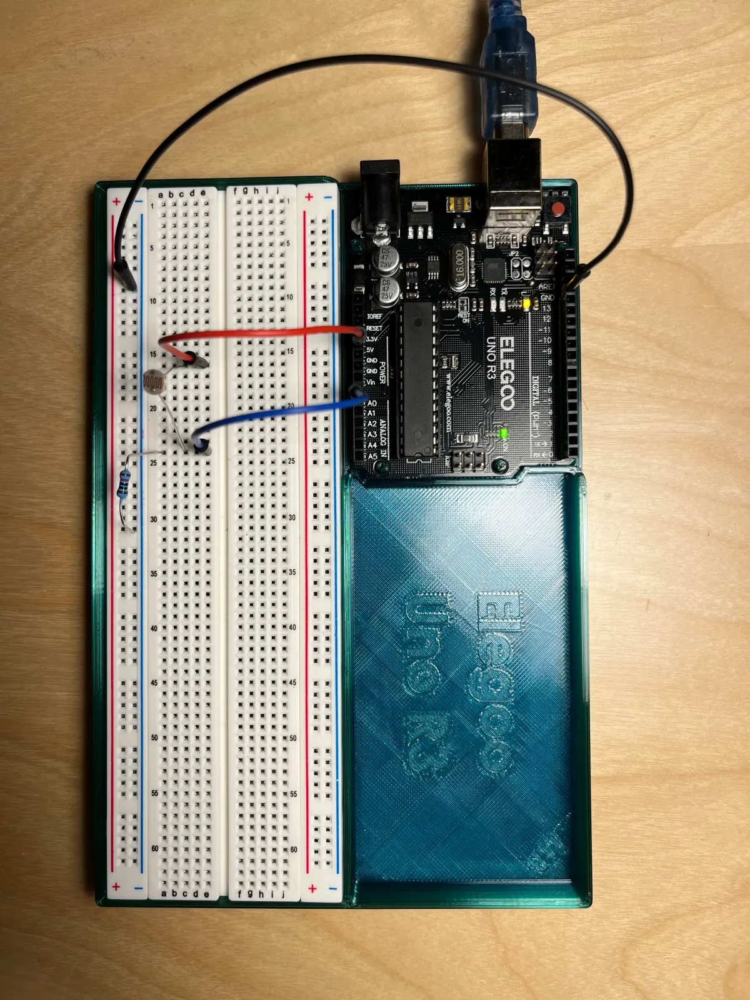
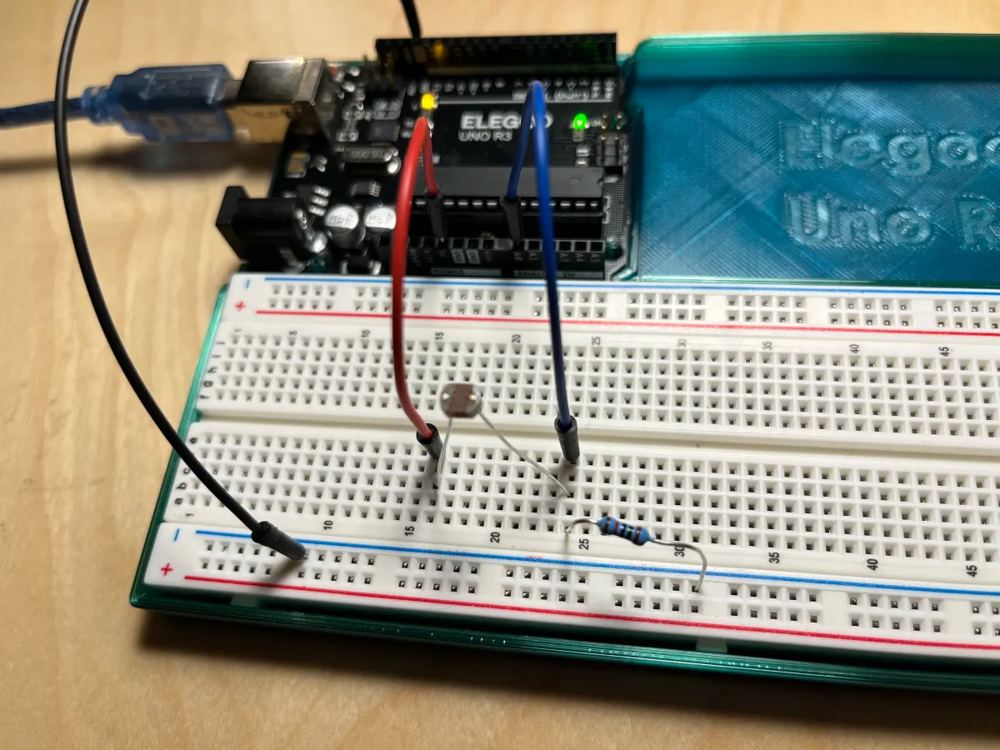

[Index](index.html)

# 2: Individual builds 


## Light sensor
Light sensor (analog input): Connect the photo cell light sensor (CdS photoresistor) to your Arduino. Have your sketch continuously print out the light level it detects on the serial monitor at 5 second intervals.

> CdS cells are little light sensors. As the squiggly face is exposed to more light, the resistance goes down. When it's light, the resistance is about ~1KΩ, when dark it goes up to ~10KΩ. 

* [Adafruit](https://www.adafruit.com/product/161)

### Source files
* [Tinker source](https://www.tinkercad.com/things/dLJOOrkPkBk/editel?sharecode=9xs5nUTewtWsfD4-hraQk-SSVEHWC6jlRYBssgM2QNc)

### Documentation
> Top down view of breadboard and Arduino


> Close up of breadboard connections


> Circuit view


> Schematic drawing


### Code

``` JS
// Light sensor (analog input): Connect the photo cell light sensor (CdS photoresistor) to your Arduino. Have your sketch continuously print out the light level it detects on the serial monitor at 5 second intervals.

const int sensorLight = A0; // Photo cell (CdS photoresistor) Product ID: 161
const int readingDelay = 5000;

void setup() {
  // To run once:
  Serial.begin(9600); // debugging

}

void loop() {
  // To run repeatedly:
  int levelLight = analogRead(sensorLight); // Read amount of light and assign a variable to it
  Serial.println(levelLight); // Print out the light level
  delay(readingDelay); // Delay between readings
}
```

## Process

1. 