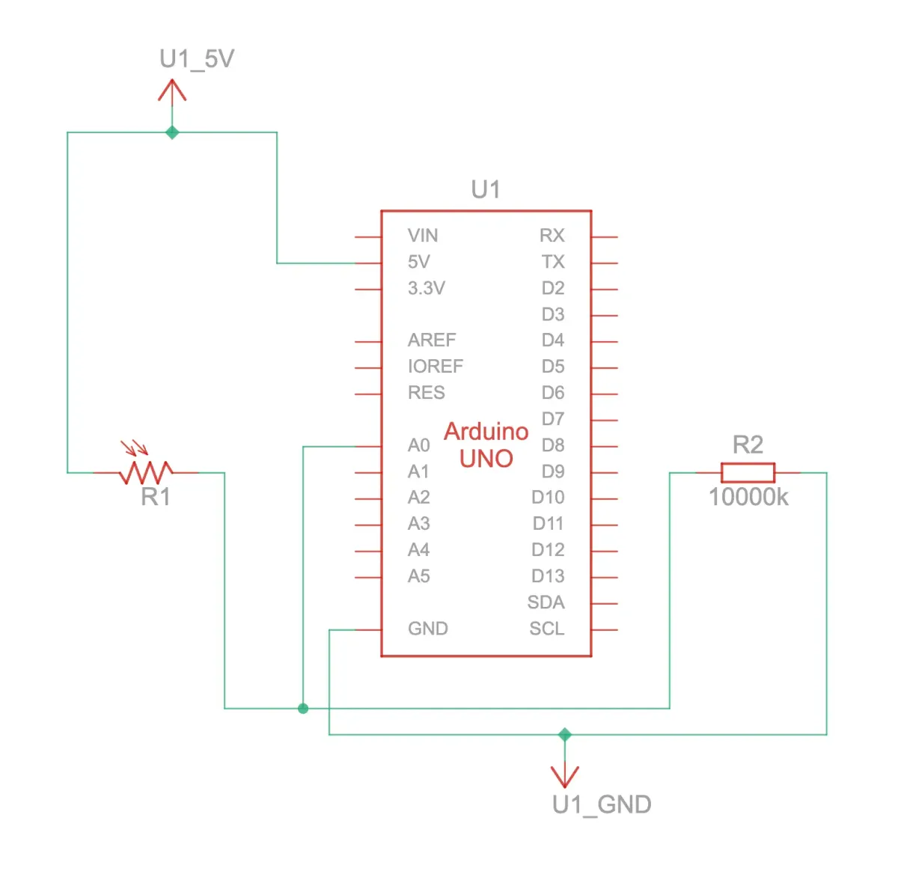
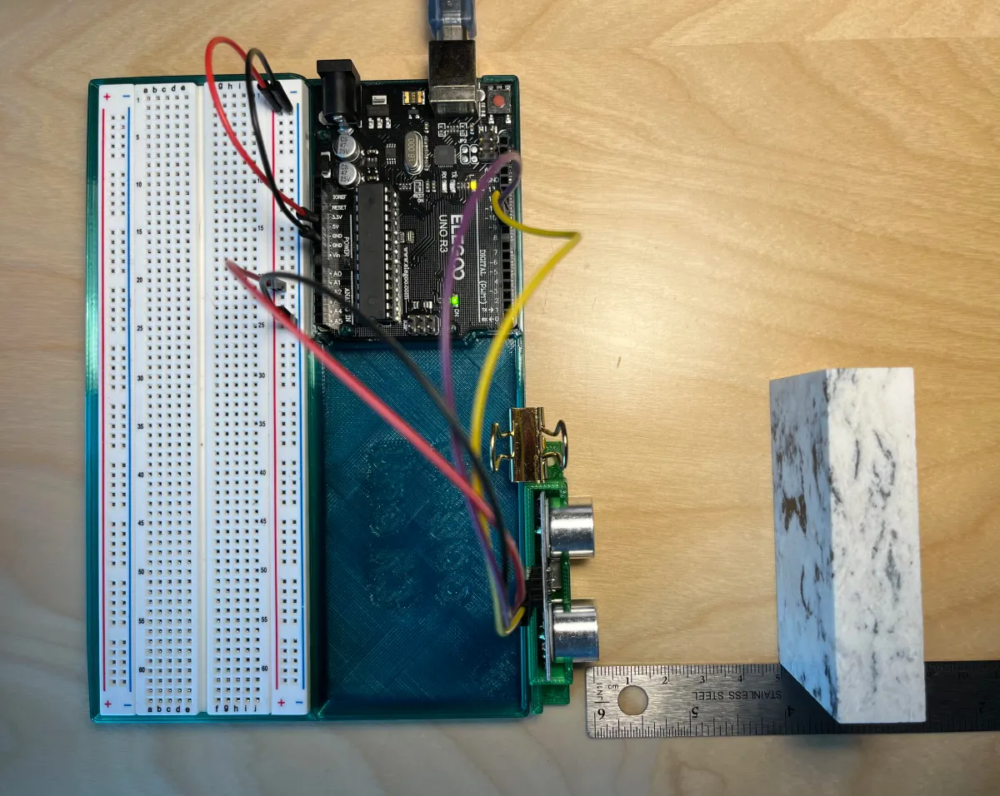

[Index](index.html)

# 2: Individual builds 

* <a href="#light-sensor">Light sensor</a>
* <a href="#tilt-ball-sensor">Tilt ball sensor</a>
* <a href="#wildcard">Wildcard: Ultrasound sensor</a>
* <a href="#process">Process and learnings</a>

<span id="light-sensor"></span>

## Light sensor
Light sensor (analog input): Connect the photo cell light sensor (CdS photoresistor) to your Arduino. Have your sketch continuously print out the light level it detects on the serial monitor at 5 second intervals.

> CdS cells are little light sensors. As the squiggly face is exposed to more light, the resistance goes down. When it's light, the resistance is about ~1KΩ, when dark it goes up to ~10KΩ. 

* [Adafruit](https://www.adafruit.com/product/161)

### Source files
* [TinkerCAD source](https://www.tinkercad.com/things/dLJOOrkPkBk/editel?sharecode=9xs5nUTewtWsfD4-hraQk-SSVEHWC6jlRYBssgM2QNc)

### Documentation
> Top down view of breadboard and Arduino


> Circuit view


> Schematic drawing



### Code

``` JS
// Light sensor (analog input): Connect the photo cell light sensor (CdS photoresistor) to your Arduino. Have your sketch continuously print out the light level it detects on the serial monitor at 5 second intervals.

const int sensorLight = A0; // Photo cell (CdS photoresistor) Product ID: 161
const int readingDelay = 5000;

void setup() {
  // To run once:
  Serial.begin(9600); // debugging

}

void loop() {
  // To run repeatedly:
  int levelLight = analogRead(sensorLight); // Read amount of light and assign a variable to it
  Serial.println(levelLight); // Print out the light level
  delay(readingDelay); // Delay between readings
}
```
---

<span id="tilt-ball-sensor"></span>

## Tilt ball sensor 
Tilt sensor (digital input): Connect the tilt sensor (digital input) to your Arduino. Have your sketch continuously print out the tilt status of the sensor.

> Tilt sensors allow you to detect orientation or inclination. They are small, inexpensive, low-power and easy-to-use. If used properly, they will not wear out... They are usually made by a cavity of some sort (cylindrical is popular, although not always) and a conductive free mass inside, such as a blob of mercury or rolling ball. One end of the cavity has two conductive elements (poles). When the sensor is oriented so that that end is downwards, the mass rolls onto the poles and shorts them, acting as a switch throw.

* [Adafruit](https://cdn-learn.adafruit.com/downloads/pdf/tilt-sensor.pdf)


* [Instructables](https://www.instructables.com/TILT-SWITCH-USING-ARDUINO-UNO-R3/)

### Source files
* [TinkerCAD source](https://www.tinkercad.com/things/5a9fzEsl5b8/editel?sharecode=qDMhLgDma2EpROBLh82YMuBuKXSKqp3fRlGIPlQQNK8)

### Documentation
> Top down view of breadboard and Arduino 


> Circuit view


> Schematic drawing


> Demo

<video width="360" height="640" controls>
  <source src="./assets/02-tilt-ball.mov" type="video/mp4">
</video>

### Code
``` JS
// Tilt sensor (digital input): Connect the tilt sensor (digital input) to your Arduino. Have your sketch continuously print out the tilt status of the sensor.

const int pinInput = 4; // Define which pin will receive input

void setup() {
  // put your setup code here, to run once:
  Serial.begin(9600);
}

void loop() {
  // put your main code here, to run repeatedly:
  // 1. Store the integer value as "digitalVal" 
  // 2. The value will be retrieved through our variable pinInput
  // 3. The function digitalRead returns "LOW" or "HIGH" values (digitalRead is input)
  // "HIGH" = a voltage greater than 3.0V is present at the pin (5V boards)
  // "LOW" = a voltage less than 1.5V is present at the pin (5V boards)
  int digitalVal = digitalRead(pinInput); 
  if (digitalVal == LOW) {
      Serial.println("Closed circuit"); // The ball is in the down position connecting both contacts
      delay(500); // so that the reading only occurs every half second
  }
  else {
    Serial.println("Open circuit"); // When the ball is moved away from the contacts, it opens the circuit
    delay(500);
  }
}
```

---

<span id="wildcard"></span>

## Wildcard
Wildcard (your choice): Create one more build using any of the above components, or anything else you find in your kit. Experiment! Some possibilities are: a potentiometer for analog input, PWM fading with LEDs, enhancing the temperature sensor demo, a sound buzzer, etc. Use the serial monitor to show what is going on.

> HC-SR04 is an ultrasonic ranging sensor that provides 2 cm to 400 cm non-contact measurement function.
> - Working Voltage: DC 5V
> - Working Current: 15mA
> - Working Frequency: 40Hz
> - Max Range: 4m
> - Min Range: 2cm
> - Measuring Angle: 15 degree
> - Trigger Input Signal: 10µS TTL pulse
> - Echo Output Signal Input TTL lever signal and the range in proportion
> - Dimensions: 45 * 20 * 15mm

* [Datasheet](https://www.electroschematics.com/hc-sr04-datasheet/)
* Since the working voltage is DC 5V and that's the max power our Arduino provides, no resistor is needed.

### Source files
* [TinkerCAD source](https://www.tinkercad.com/things/8IpxSyeaScC/editel?sharecode=cMtBSYslvCrmXvzehgO11qDc-72Pc_1NVtGS03TxCrM)

### Documentation

> Top down view of breadboard and Arduino
> 
> The code and setup are running as expected in TinkerCAD, and yet in real life, my serial monitor stops printing anything higher than 3.6cm distance, despite the object sitting further. I tried to troubleshoot the problem a few ways but none worked. So I'll ask a classmate if I can borrow their sensor to see if I have a faulty component.
> 1. Replacing the code with two other examples
> 1. Using a hard surface for the ping to bounce off of
> 1. 3D printed a container for the sensor to ensure it is at a 90 degree angle
> 1. Tried using a library called [newPing](https://bitbucket.org/teckel12/arduino-new-ping/wiki/Home)
> 1. Ensuring there's no other sound that could interfere
> 


> Circuit view


> Schematic drawing


### Code
``` JS
/*
 Original code from: 
 HC-SR04 example sketch https://projecthub.arduino.cc/Isaac100/getting-started-with-the-hc-sr04-ultrasonic-sensor-7cabe1 by Isaac100
 With modifications on:
 - Serial output format
 */

const int trigPin = 9; // The sensor will "trigger" a small sound
const int echoPin = 10; // The sensor will also receive the sound's echo
char distanceString[20]; // Temporary string storage
char serialOutput[100]; // Temporary string storage

float duration, distance;

void setup() {
  pinMode(trigPin, OUTPUT);
  pinMode(echoPin, INPUT);
  Serial.begin(9600);
}

void loop() {
  digitalWrite(trigPin, LOW); // No sound is emitted 
  delayMicroseconds(2); // Buffer
  digitalWrite(trigPin, HIGH); // Send sound
  delayMicroseconds(10); // Send an 8 cycle sonic burst
  digitalWrite(trigPin, LOW); // Stop emitting sound

  duration = pulseIn(echoPin, HIGH); // First argument is the pin we're listening to when it's at the specified state in the second argument. It starts a timer when trigPin is HIGH then stops when trigPin state changes to LOW
  distance = (duration*.0343)/2; // speed = distance/time with sound of speed at 340meters/second. Divide by 2 since the sound is traveling twice, once to the object and again from the object.
  dtostrf(distance, 6, 1, distanceString); // To convert a floating point value to a string since the sprintf function can't accept float
  sprintf(serialOutput, "Distance: %s cm", distanceString); // string print format function to output a single line, arguments: string storage, string output with format specifiers, and variable you're inserting into the string 
  Serial.println(serialOutput);
  delay(500); // Slight delay for printing the output
}
```
---

<span id="process"></span>

## Process & Learnings
* The meaning of `HIGH` (in reference to a pin) is somewhat different depending on whether a pin is set to an `INPUT` or `OUTPUT`. [See Arduino documentation.](https://docs.arduino.cc/language-reference/en/variables/constants/highLow/)
* It's surprisingly difficult to concatenate debugging strings compared to Python, some resources: [sprintf function](https://www.programmingelectronics.com/sprintf-arduino/); [dtostrf()](https://www.programmingelectronics.com/dtostrf/). These functions weren't in the [Arduino documentation](https://docs.arduino.cc/language-reference/) since, I later learned, there is Arduino specific functions and the rest is C.
* [Microsoft's documentation for C](https://learn.microsoft.com/en-us/cpp/c-language/?view=msvc-170)
* The lack of a reliable source for component data sheets and consistent information across data sheets is frustrating.
* Found another virtual circuit construction kit: [DC Virtual Lab](https://phet.colorado.edu/sims/html/circuit-construction-kit-dc-virtual-lab/latest/circuit-construction-kit-dc-virtual-lab_en.html0).