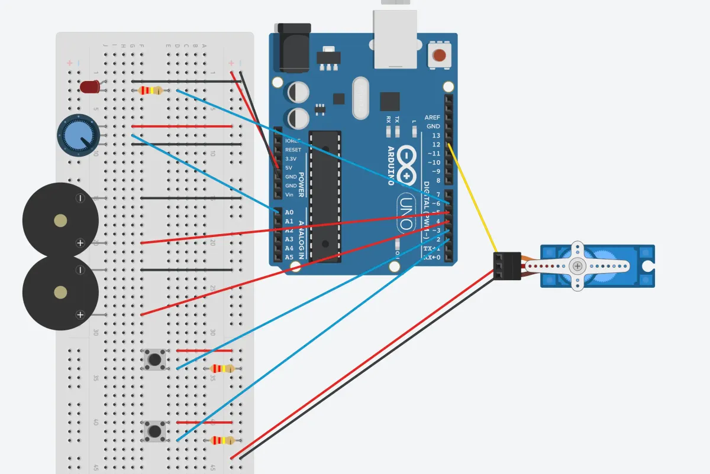
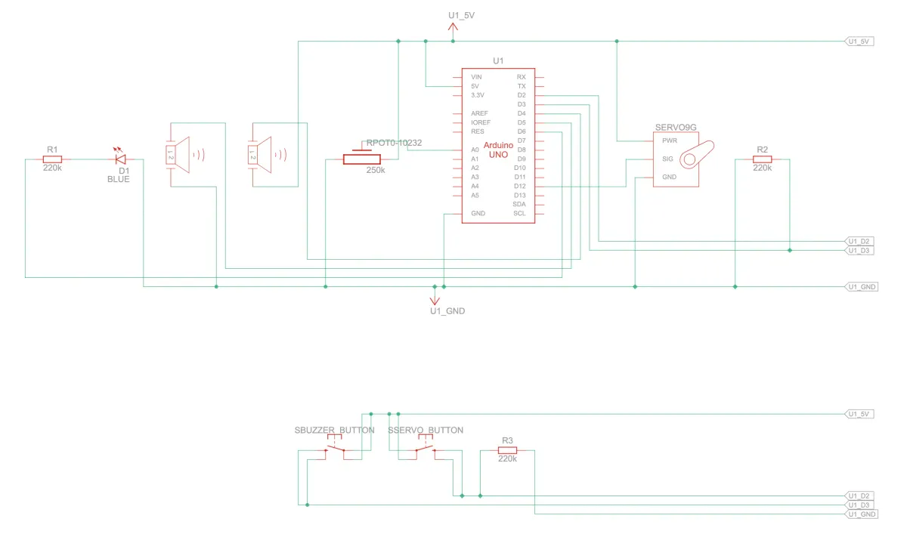

[Index](index.html)

# Integrated builds

1. Use a trim pot (potentiometer, or variable resistor, an analog input sensor) in combination with an LED to simulate a dimmer switch for light control. Although we said that LEDs are digital output actuators (only on or off), there is a trick you can use to fake the LED into behaving like an analog output.
2. Door bell: Use a button in combination with a simple piezo buzzer to create a prototype of a door bell. When you click the button, the buzzer goes off for a few seconds. For an extra challenge, you could take advantage of the feature in the button library to do something with the capability to detect a longer press as distinct from a simple button press. Be creative!
3. Door Opener: Use a button to simulate a person stepping on a mat outside a supermarket entrance door. When the button is triggered, the door should open, stay open for 5 seconds, and then close.  

## Source files
* [TinkerCAD source](https://www.tinkercad.com/things/0Tl4qEiTSuJ/editel?sharecode=lVPPhKP5lYT_n1I6WCdNQB4i8m_dSqc0DnJFyk5gzks)

## Documentation
> Top down view of breadboard and Arduino


> Circuit view



> Schematic drawing



## Code

``` JS
#include <Button.h>
#include <Servo.h>

// Outputs
const int LED_FADE = 6;
const int BUZZER_SINGLE = 5;
const int BUZZER_MUSIC = 4;
const int DOOR = 12;
// Inputs
const int POTENTIOMETER = A0;
const int BUTTON_BUZZER = 3;
const int BUTTON_DOOR = 2;

// Configurable variables
int potVal = 0; // Set inital value of the potentiomater
int prevPotVal = 0; // Capture previous potentiometer value
int potThreshold = 5;
int delayTimeSound = 500; // Time between buzzer tones
int doorOpen = 180; // Door opens to 180 degrees
int delayTimeDoor = 5000;
int doorCloses = 0; // Door closes to 0 degrees


// Declare a button and a servo
Button buttSound (BUTTON_BUZZER);
Button buttDoor (BUTTON_DOOR);
Servo myservo;

void setup() {
  // Tell Serial what this file will do
  Serial.begin(9600);
  Serial.println("Part 1: Potentiometer --> PWM LED");
  Serial.println("Part 2: Button --> sound");
  Serial.println("Part 3: Button --> servo door");
  Serial.println();
  // Setup pins
  pinMode(LED_FADE, OUTPUT);
  pinMode(BUTTON_BUZZER, INPUT);
  pinMode(BUZZER_SINGLE, OUTPUT);
  pinMode(BUZZER_MUSIC, OUTPUT);
  myservo.attach(DOOR);
};

void loop() {
  // Part 1 - Light
  // Read the value from the analog pin; store its value in the variable "potVal"
  potVal = analogRead(POTENTIOMETER);
  // Output to LED the potentiometer's value; divides any value between 0-1023 into 0-255; print potentiometer value
  analogWrite(LED_FADE, potVal/4); 
  
  if (abs(prevPotVal - potVal) >= potThreshold) {
    Serial.print("Current: ");
    Serial.println(potVal);
    Serial.println("");
  } else {
    // Serial.print("No change: ");
    // Serial.println(potVal);
    // Serial.println("");
  };

  prevPotVal = potVal;

  // Part 2 - Sound
  // check the status of the button (what happened?)
  int buttonStateSound = buttSound.checkButtonAction();
  // When button is pressed, trigger active buzzer (play single tone)
  if (buttonStateSound == Button::CLICKED) {
    digitalWrite(BUZZER_SINGLE, HIGH);
    Serial.println("Button pressed - Active buzzer");
  }
  // When button is pressed, trigger passive buzzer (play music)
  else if (buttonStateSound == Button::HELD_CLICKED) {
    tone(BUZZER_MUSIC, 440);
    delay(delayTimeSound);
    tone(BUZZER_MUSIC, 494);
    delay(delayTimeSound);
    tone(BUZZER_MUSIC, 523);
    delay(delayTimeSound);
    Serial.println("Button pressed - Passive buzzer");
  }
  else {
    digitalWrite(BUZZER_SINGLE, LOW);
    noTone(BUZZER_MUSIC);
  };


  // Part 3 - Door opener
  // check the status of the button (what happened?)
  int buttonStateDoor = buttDoor.checkButtonAction();
  // When button is pressed, rotate servo 180 degrees
  if (buttonStateDoor == Button::CLICKED) {
    myservo.write(doorOpen);
    Serial.println("Door opens");
    delay(delayTimeDoor);
    myservo.write(doorCloses);
  }
  else {};
};
```

## Process & Learnings
* Serial monitor only prints the potentiometer reading correctly (when diff between prev and current reading is above a certain threshold) when it's also printing 0 diff between prev and current.
* When triggering the servo button, it changes the potentiometer! 