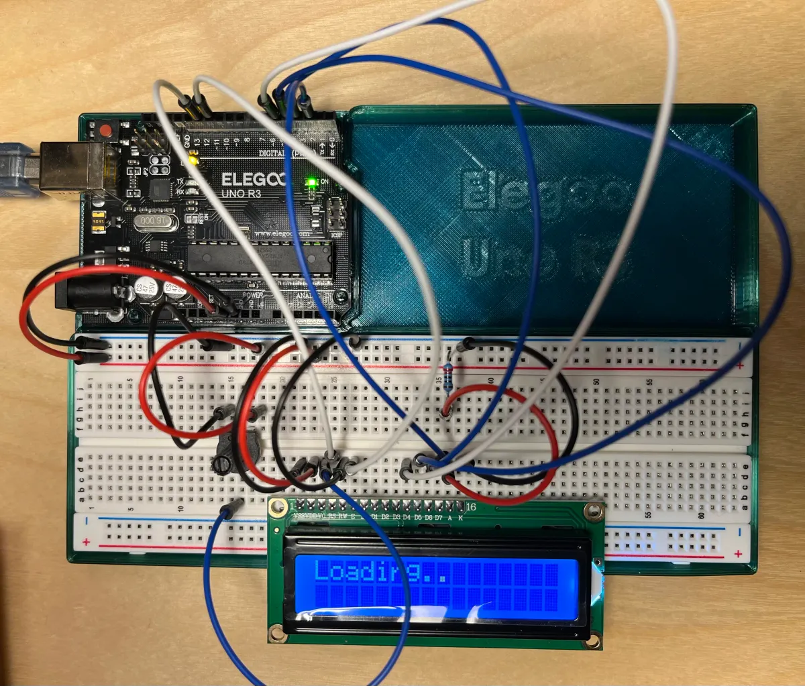

[Index](index.html)

# LCD messages

## Assignment description
> The purpose of this assignment is to use an LCD attached to your Arduino to display messages. This will afford you many more possibilities for creating interactive systems that can stand alone, without being tethered to a laptop. 
>
> After that, to do something more concrete, develop an Arduino program that displays actual messages under control of your program on it. This is done by using the various software library commands to set the cursor position of the LCD, write text, erase the screen, etc.
> 
> You can develop your own application, or you can simply enhance one of your other builds to show messages on the LCD as well as on the serial monitor.

The following build will do a simple "Loading..." message that animates in 3 ellipses, clears it, and re-prints the ellipses again.

### Source files
* [Circuit and schematic diagrams](https://docs.arduino.cc/learn/electronics/lcd-displays/#hello-world-example:~:text=breadboard-,Circuit,-Note%20that%20this)

### Documentation
> Top down view of breadboard and Arduino



### Code

``` JS
#include <LiquidCrystal.h>

// initialize the library by associating any needed LCD interface pin
// with the arduino pin number it is connected to
const int rs = 12, en = 11, d4 = 5, d5 = 4, d6 = 3, d7 = 2;
LiquidCrystal lcd(rs, en, d4, d5, d6, d7);

// Changing variables
int countEllipsis = 0;

void setup() {
  Serial.begin(9600);
  // set up the LCD's number of columns and rows:
  lcd.begin(16, 2);
  // Print a message to the LCD.
  lcd.print("Loading");
}

void loop() {
  // Set cursor to after "Loading" string
  lcd.setCursor(7,0);
  // Clear everything after first row, slot 7
  lcd.print("   ");
  // Set cursor back to after "Loading"
  lcd.setCursor(7,0);
  // Add ellipsis
  for (int i = 0; i < countEllipsis; i++) {
    lcd.print(".");
  }
  // Add to our tracker and set a conditional that, once met, will reset our tracker
  countEllipsis++;
  if (countEllipsis > 3) {
    countEllipsis = 0;
  }
  // Debug
  Serial.println(countEllipsis);
  // Add a pause between each ellipsis
  delay(500);
}
```

### Serial monitor output sample
``` JS
0
1
2
3
0
1
2
3
0
1
2
3
```

### Process & Learnings
* [LiquidCrystal functions documentation](https://docs.arduino.cc/libraries/liquidcrystal/)
* At first I couldn't figure out why the first ellipsis wasn't getting cleared. Turns out you need to clear and reposition the cursor each time ([Arduino forums](https://forum.arduino.cc/t/clearing-characters-in-lcd-print/379481/4)).