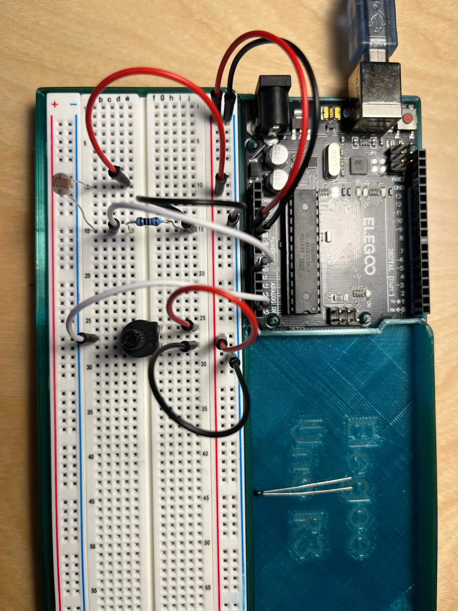
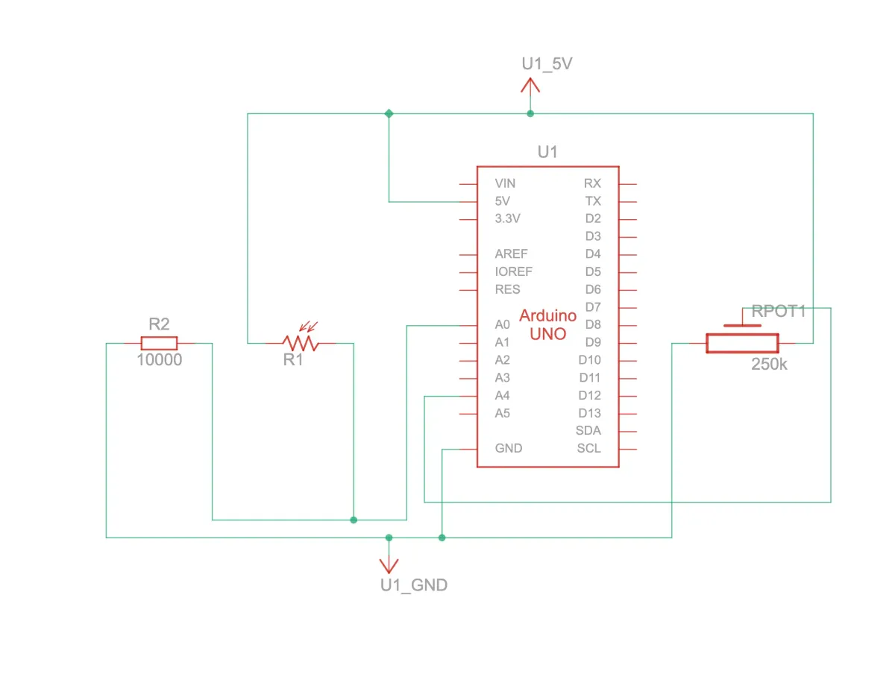
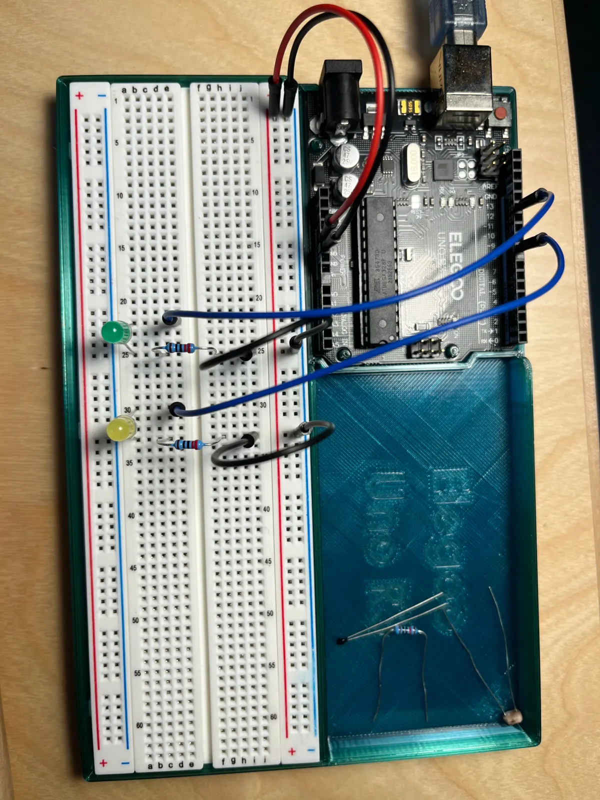

[Index](index.html)

# Functions
DO NOT USE ChatGPT or any other AI to write code for this assignment .

For this assignment you will write two (2) functions:

Function 1. Takes a pin number as an argument and return a sensor reading as an Int mapped from 1-100

Function 2. Takes an Int and uses it to fade or blinks an LED

## Assignment description

### Source files
* [TinkerCAD source](https://www.tinkercad.com/things/iF6CzltskmB/editel?returnTo=%2Fdashboard%2Fdesigns%2Fcircuits&sharecode=g0FQ-bh2h9p4Jq9OYQSrg4UjInJ-FF7-mQ9ecc69fnw)

### Documentation
> Top down view of breadboard and Arduino



> Circuit view


> Schematic drawing



> Trying to figure out how the timing was going to work



### Code

``` JS
// Outputs
const int LED_GREEN = 12;
const int LED_YELLOW = 8; 

// Inputs
const int SENSOR_LIGHT = A0;
const int SENSOR_TEMP = A1;
const int SENSOR_POT = A4;

// Run
void setup() {
  Serial.begin(9600);
  pinMode(LED_GREEN, OUTPUT);
  pinMode(LED_YELLOW, OUTPUT);
}

void loop() {
  sensor(SENSOR_LIGHT);
  sensor(SENSOR_POT);  
  blinker(LED_GREEN, 2000, 1000);
  blinker(LED_YELLOW, 500, 500);
}

// === Functions ===

// Function 1. Takes a pin number as an argument and return a sensor reading as an Int mapped from 1-100
int sensor(int _sensor) {
  // Variables
  int sensorRaw;
  int sensorMapped;
  // Get reading, map result to 1-100
  sensorRaw = analogRead(_sensor);
  sensorMapped = sensorRaw/10.23;
  return sensor;
}

// Function 2. Takes an Int and uses it to fade or blink an LED
void blinker(int _led, int _onTime, int _offTime) {
  // Set up initial values that persists (static) with extended sizes (long) and doesn't change to a neg number (unsigned)
  static unsigned long timerStart = 0;
  static unsigned long timeElapsed = 0;
  // Set up variables
  unsigned long timer = timerStart + timeElapsed;
  unsigned long time = millis();

  // When time elapsed minus timer is greater or equal to time light should be on, turn light off 
  // first run-through: when time elapses past onTime then turn LED off, timer will be 0
  // second run-through: timer should now be what time was before, 2.01 seconds, next trigger should be at 4 seconds
  if (time - timer >= _onTime) {
    digitalWrite(_led, LOW);
    // Reset timer only when the light has been off long enough
    if (time == timer + _onTime + _offTime) {
      timeElapsed = millis();
      Serial.println(timer);
    }
  // Light is on all other times
  } else {
    digitalWrite(_led, HIGH);
  }
}
```

### Process & Learnings
- Blinker
  - To get a sense for what should happen when, I built a spreadsheet. I found this much easier to track and quicker to iterate the initial draft than it was to look at the Serial output.
  - The code for the blinker works for one LED but I couldn't reconcile both LEDs working at the same time. When I extracted the code back into the loop, duplicated one for each LED, and assigned a unique global timer variable, then the LEDs blinked correctly. 