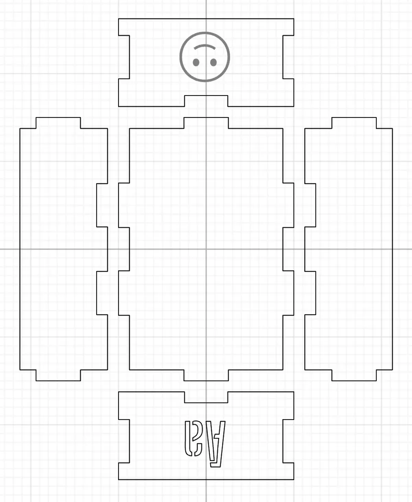

[Index](index.html)

# Laser cut object

## Assignment description
Make something on the laser cutter -- we just want to be sure that everyone has a chance to go through the process of creating a 2D design and getting it made in the physical world, on the laser cutter.

The default challenge is an enhanced box of some sort. This could be just for fun, or it could be something for your final project. Instead of doing it all from scratch, say in Illustrator or another vector graphics program, you can use one of these tools to create your box design:
- boxdesigner.connectionlab.org
- festi.info/boxes.pyLinks

Whatever tool you use, your design must utilize both cutting and engraving, and should include some text as well.

### Source files
* Duplicated from Cuttle Labs ([Open box with finger joints](https://cuttle.xyz/@cuttle/Open-Box-with-Finger-Joints-D2ugGEvYUNfd)) [Cuttle source](https://cuttle.xyz/@tflo/Open-Box-with-Finger-Joints-oh2qPcIg7soZ) 

### Documentation
> Design file in Cuttle

> Box

### Process & Learnings